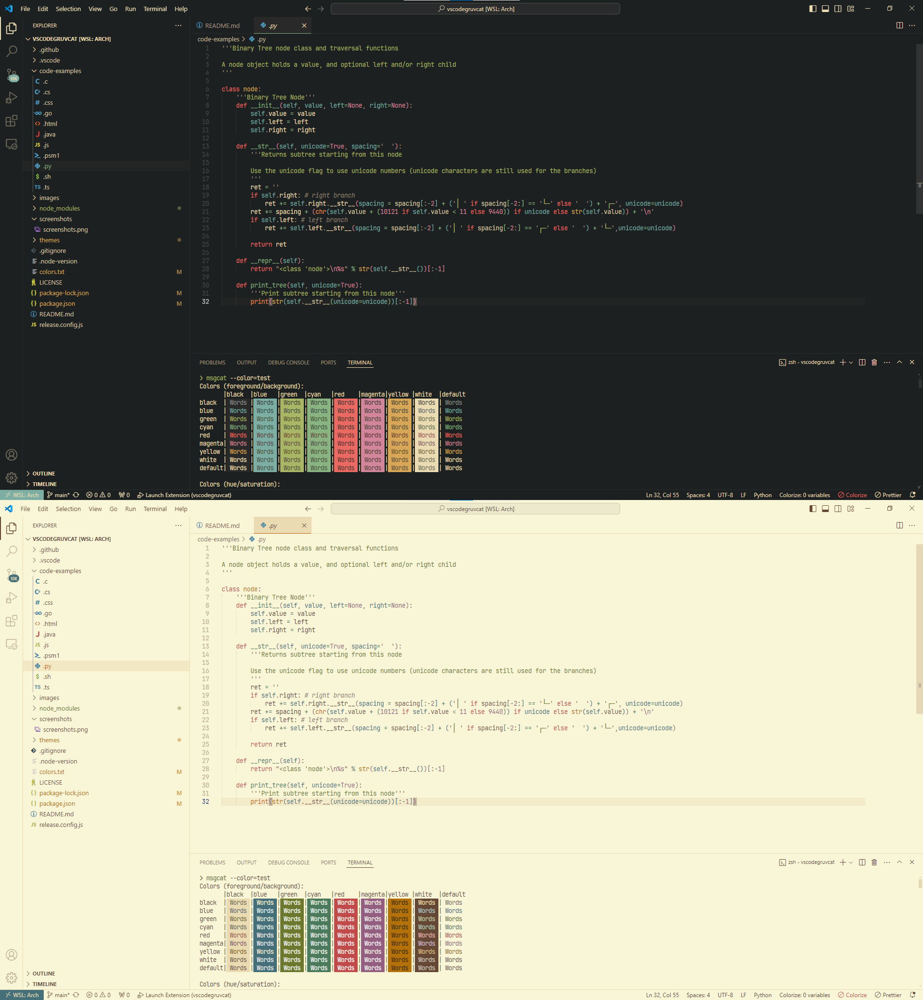

<h1 align="center">
   
  
   
  Gruvcat
   
</h1>

<h4 align="center">A fusion of Gruvbox and Catppucin theme to VS Code</h4>

  
  
  
  

## About

A [gruvbox](https://github.com/morhetz/gruvbox) and [catppuccin](https://github.com/catppuccin/catppuccin) fusion theme including syntax highlighting and workbench & terminal colors.

## Variants

- Gruvcat Dark
- Gruvcat Light

### Screenshots

## Contributing

Please, report issues/bugs and suggestions for improvements [here](https://github.com/frsqredm/vscode-gruvcat-theme/issues).

Please contribute if you have any suggestions.

### Tips

- In the `json` file, `scope` can be an `array` or a `string` of CSS classes
- VSCode's `Developer: Inspect TM Scopes` command is useful to find out the scope
- `colors.txt` contains available colors

## Release Notes

See [changelog](CHANGELOG.md).

## Credits

Special thank to 
- [Pavel Pertsev](https://github.com/morhetz), the creator of [gruvbox](https://github.com/morhetz/gruvbox) original theme.

- [jdinhify](https://github.com/jdinhify), the creator of [vscode-theme-gruvbox](https://github.com/jdinhify/vscode-theme-gruvbox).

- [Catppuccin](https://github.com/catppuccin/catppuccin) original theme.

- [thanhvule0310](https://github.com/thanhvule0310) at this [conversation](https://github.com/catppuccin/nvim/discussions/323#discussioncomment-5287724).

Copyright (C) 2024 [FD](https://github.com/frsqredm)
